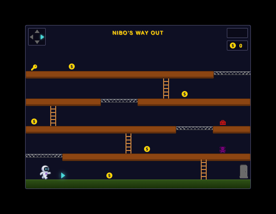

# Nibo's Way Out

A simple platform game in HTML/CSS (no JavaScript), completely  created in an
interactive session with [Claude Code](https://claude.com/product/claude-code).

Help Nibo the little spaceman to find his way out of the level.

## Stage 1:

# Project location

 - [GitHub](https://github.com/ruittenb/nibo-game)

# Icons

Copied from and/or inspired by

 - [Font Awesome](https://fontawesome.com/search?q=rock&ic=free-collection)
 - [Material Design Icons](https://pictogrammers.com/library/mdi/)

# Similar work by others

 - [The Mine](https://codepen.io/jcoulterdesign/pen/NOMeEb) by Jamie Coulter
 - [CSScape room](https://csscape-room.iamdanielmarino.com/) by Daniel Marino

